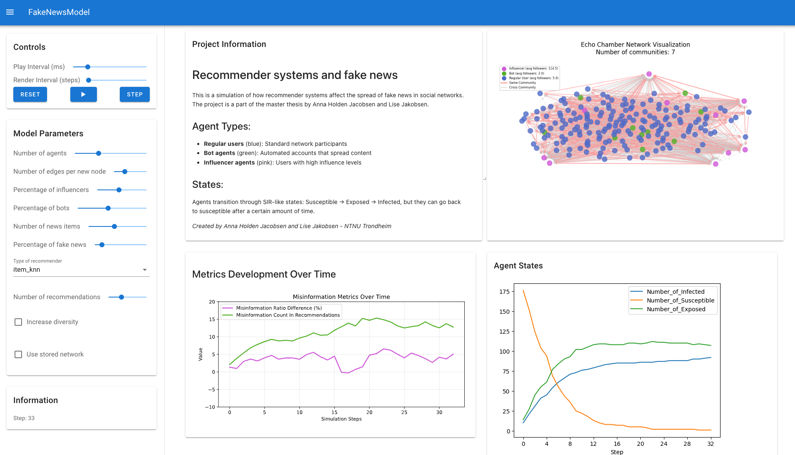

# MasterRaFakeNews

Master thesis repository for Anna Johanne Holden Jacobsen and Lise Jakobsen - Computer Science students at NTNU Trondheim.

## Project Description

An agent-based model (ABM) simulation of fake news propagation in social networks. The model simulates how different types of agents (regular users, bots, and influencers) interact with and spread news content through a social network structure.

Diagrams can be found in the [diagrams](diagrams) folder.

## Features

- Agent-based modeling using Mesa framework
- Social network simulation using NetworkX
- Different agent types:
  - Regular users
  - Bot agents
  - Influencer agents
- News content classification (real/fake)
- Network metrics and visualization
- SIR-like state transitions (Susceptible → Exposed → Infected)
- Preference-based network formation
- Community detection using Louvain method
- Experimentation and data collection
- Data visualization

## Dashboard



The Solara dashboard provides an interactive interface to run and visualize the simulation. It allows you to:
- Adjust simulation parameters in real-time
- View the network graph with different agent types and states
- Monitor key metrics as the simulation progresses
- Observe how misinformation spreads through the network

## Requirements

- pandas
- numpy
- networkx
- mesa
- lenskit
- altair
- matplotlib
- seaborn
- solara
- python-louvain
- dppy

## Installation

1. Clone the repository:

```bash
git clone https://github.com/annajacobsen/MasterRaFakeNews.git
cd MasterRaFakeNews
```

2. Create and activate a virtual environment:

```bash
python3.11 -m venv .venv
source .venv/bin/activate
```

3. Install dependencies:

```bash
pip install -r requirements.txt
```

## Usage

To run the simulation:

```bash
solara run model.py
```

This will launch a Solara visualization interface where you can:
- Adjust the number of agents (5-100)
- Modify the number of edges per new node (1-5)
- View network visualization
- Monitor metrics like:
  - Number of Infected/Susceptible/Exposed agents
  - Misinformation Ratio Difference
  - Misinformation Count in Recommendations

### Run experiments

```bash
python3 experiments.py
```
You can modify the parameters in the `experiments.py` file.

Experiment results are saved in the `experiment_results` folder.

### Plotting results
After running experiments, you can generate plots to visualize the results:

```bash
python3 plot.py experiment_results/{experiment_name}.csv --output-dir plots
```
Remember to replace `{experiment_name}` with the name of the experiment file you want to plot, along with the correct timestamp.

## Project Structure

- `model.py`: Main simulation model
- `agents/`: Agent definitions and behaviors
  - `user_agent.py`: Regular, Bot, and Influencer agent implementations
- `objects/`: Core simulation objects
  - `news_content.py`: News content representation
  - `social_network.py`: Network structure and dynamics
  - `social_media_platform.py`: Platform that connects network and recommender
- `recommender/`: Content recommendation system
- `utils/`: Helper functions and utilities
  - `metrics.py`: Network analysis metrics
  - `datacollector.py`: Data collection and storage
  - `visualization.py`: Visualization components
  - `similarity.py`: Content similarity calculations
  - `agents_utils.py`: Agent behavior utilities
  - `objects_utils.py`: Network creation and manipulation
  - `model_utils.py`: Model initialization helpers
- `experiments.py`: Experiment runner
- `plot.py`: Plotting results
- `experimental_results/`: Results from experiments
- `plots/`: Plots generated by `plot.py`

## License

This project is licensed under the MIT License - see the [LICENSE](LICENSE) file for details.

## Authors

- Anna Johanne Holden Jacobsen
- Lise Jakobsen

Department of Computer Science  
Norwegian University of Science and Technology (NTNU)  
Trondheim, Norway
